# PRISM

A non-linear macroeconomic simulator. 47 real policy levers feed a 3,008-weight neural network that computes 15 economic indicators. 10,000 autonomous agents across 8 political factions react in real time. Causal relationships are extracted from live World Bank and IMF reports by an LLM — not hardcoded.

<picture>
  <source media="(prefers-color-scheme: dark)" srcset="docs/banner-v2-dark.png">
  <source media="(prefers-color-scheme: light)" srcset="docs/banner-v2-light.png">
  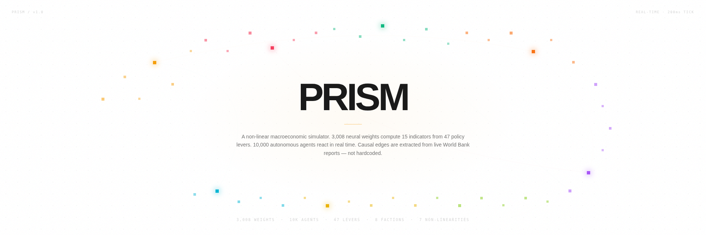
</picture>

## The reactor

47 policy levers, grouped into 8 categories, rising like prisms from a baseline. Each prism's height encodes its current value. When you adjust one, the neural network recomputes all 15 indicators, agents react, and the prisms shift in real time. The bright prisms below are mid-perturbation — a value just changed, and the causal edges are propagating outward.

<picture>
  <source media="(prefers-color-scheme: dark)" srcset="docs/reactor-prisms-dark.png">
  <source media="(prefers-color-scheme: light)" srcset="docs/reactor-prisms-light.png">
  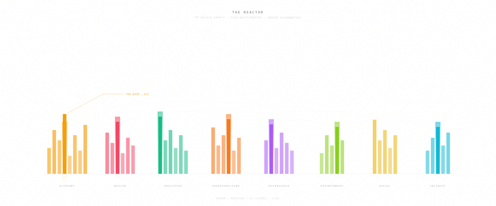
</picture>

## The neural network

A custom MLP, 47 → 32 → 32 → 15, implemented in TypeScript with no TensorFlow or PyTorch. 3,008 learnable weights. ReLU activations, He initialization, SGD with momentum. The bright paths below are the active signal propagating through the network on a live forward pass. The output nodes with radial glows are the indicators currently being computed.

<picture>
  <source media="(prefers-color-scheme: dark)" srcset="docs/neural-active-dark.png">
  <source media="(prefers-color-scheme: light)" srcset="docs/neural-active-light.png">
  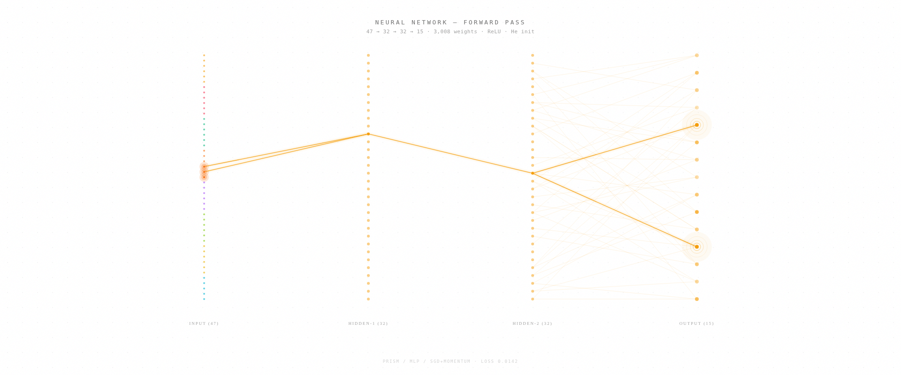
</picture>

## The agent swarm

10,000 autonomous agents, 8 factions: labor, employers, military, clergy, youth, rural, urban elite, informal economy. Each agent carries trust, stress, capital, and mobility. When stress crosses a threshold, agents strike, riot, or rebel. The hot pockets below are factions where stress has crossed 0.7 — strike risk is live.

<picture>
  <source media="(prefers-color-scheme: dark)" srcset="docs/agent-swarm-dark.png">
  <source media="(prefers-color-scheme: light)" srcset="docs/agent-swarm-light.png">
  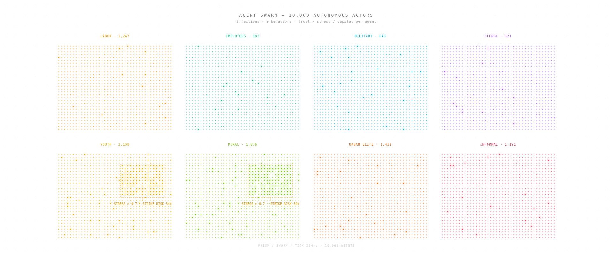
</picture>

## The causal graph

Every edge below was extracted from a real World Bank or IMF document by an LLM. Each edge carries a coefficient (−1 to +1), a delay in months, a confidence score, and a provenance URL. Nothing is hardcoded. Feed the system more reports and the graph grows denser.

<picture>
  <source media="(prefers-color-scheme: dark)" srcset="docs/causal-graph-dark.png">
  <source media="(prefers-color-scheme: light)" srcset="docs/causal-graph-light.png">
  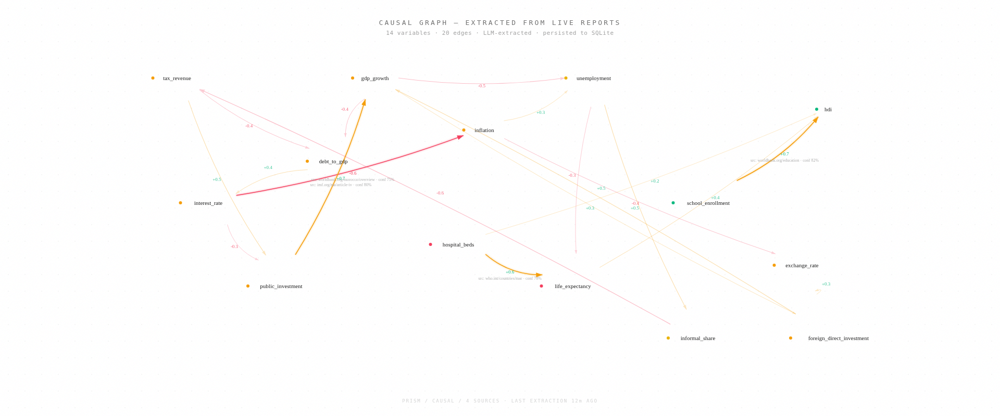
</picture>

## The decree engine

Type a decree in French. The system parses it, identifies the affected levers, calculates the fiscal cost, and simulates 2 years forward. The projection below shows five indicator trajectories after the decree lands. The verdict engine returns one of four classifications: favorable, mitigé, défavorable, or catastrophique.

<picture>
  <source media="(prefers-color-scheme: dark)" srcset="docs/decree-projection-dark.png">
  <source media="(prefers-color-scheme: light)" srcset="docs/decree-projection-light.png">
  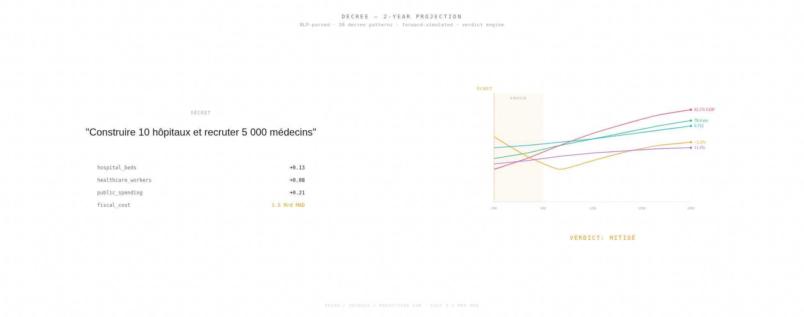
</picture>

## Black swan events

Ten crisis types strike stochastically: pandemic, earthquake, market crash, coup, drought, cyberattack, refugee crisis, oil shock, harvest failure, diplomatic crisis. Each one can trigger cascading chains. When the system is fragile, up to three crises hit simultaneously. The chain below is the engine's live output when fragility is high — each arrow carries a conditional probability.

<picture>
  <source media="(prefers-color-scheme: dark)" srcset="docs/black-swan-cascade-dark.png">
  <source media="(prefers-color-scheme: light)" srcset="docs/black-swan-cascade-light.png">
  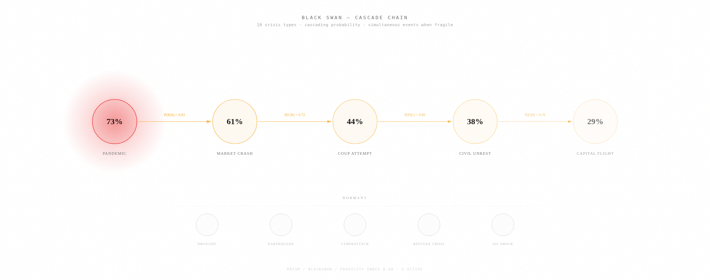
</picture>

## The paradigm engine

Switching political regime doesn't just change parameters. It rewrites the causal weight matrix and flips edge polarities. Under a planned economy, raising interest rates no longer suppresses public investment — the state invests regardless. Five regimes are available: Liberalism, Planned, Technocracy, Authoritarian, Transition. The matrix below is mid-rewrite — the transition front is moving left to right.

<picture>
  <source media="(prefers-color-scheme: dark)" srcset="docs/paradigm-shift-dark.png">
  <source media="(prefers-color-scheme: light)" srcset="docs/paradigm-shift-light.png">
  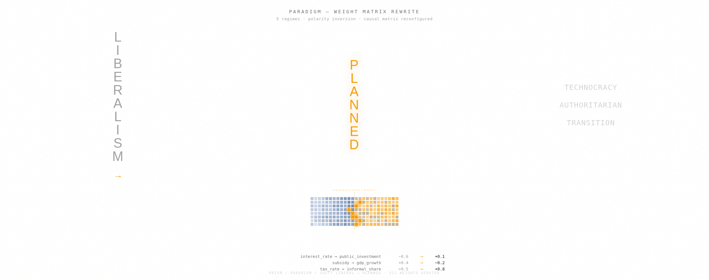
</picture>

## Architecture

<picture>
  <source media="(prefers-color-scheme: dark)" srcset="docs/architecture-dark.png">
  <source media="(prefers-color-scheme: light)" srcset="docs/architecture-light.png">
  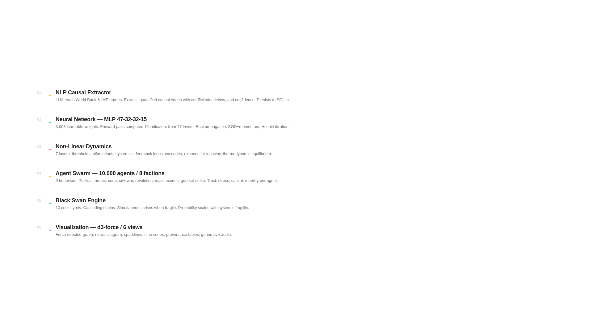
</picture>

The engine processes data through six layers. Each layer transforms its input without hardcoded rules — the system learns causal relationships from real documents and computes indicators via a trained neural network.

## Non-linear dynamics

Seven layers of non-linearity sit between the neural network output and the indicators a policymaker reads. Each one transforms the signal: critical thresholds, bifurcations, hysteresis, feedback loops, cascades, exponential runaway, and thermodynamic equilibrium. The stack below shows the signal descending through all seven, with the active transforms glowing.

<picture>
  <source media="(prefers-color-scheme: dark)" srcset="docs/nonlinear-stack-dark.png">
  <source media="(prefers-color-scheme: light)" srcset="docs/nonlinear-stack-light.png">
  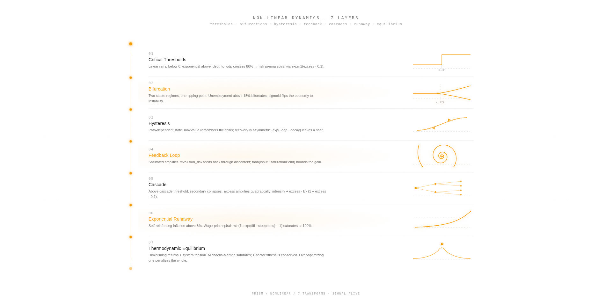
</picture>

## Hysteresis

When a crisis hits, unemployment spikes. When the crisis passes, unemployment falls — but not all the way back. The system remembers. The gap between full recovery and actual recovery is the scar. It decays over eighteen months if nothing else goes wrong. This is why the simulator exists: to feel the scar before it is carved into a real country.

<picture>
  <source media="(prefers-color-scheme: dark)" srcset="docs/hysteresis-scar-dark.png">
  <source media="(prefers-color-scheme: light)" srcset="docs/hysteresis-scar-light.png">
  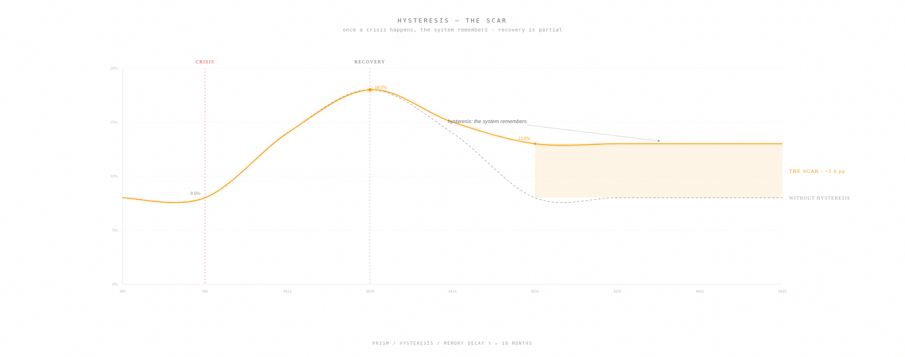
</picture>

## Thermodynamic equilibrium

You cannot maximize one sector without paying for it elsewhere. The system conserves fitness the way a thermodynamic system conserves energy. Push GDP too hard and the whole country slides off the peak. The landscape below is the penalty surface the engine navigates every tick.

<picture>
  <source media="(prefers-color-scheme: dark)" srcset="docs/thermodynamic-balance-dark.png">
  <source media="(prefers-color-scheme: light)" srcset="docs/thermodynamic-balance-light.png">
  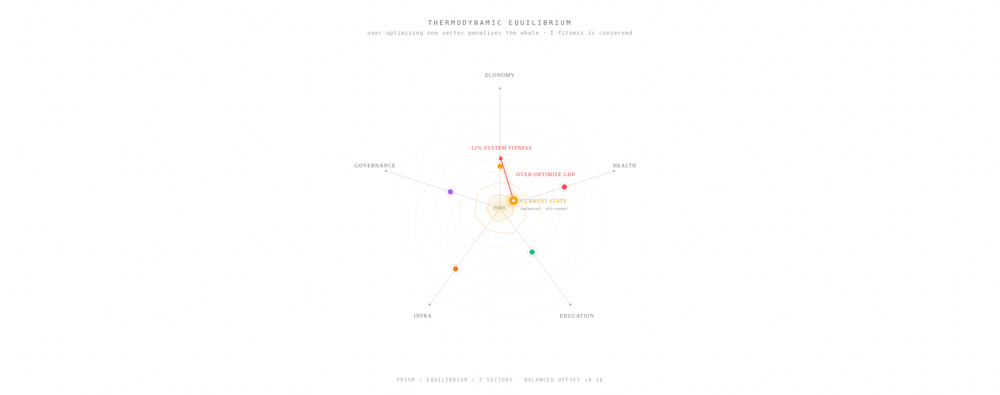
</picture>

## How it works

You pick a policy lever — say, the VAT rate. You drag it from 20% to 25%. The neural network forward-passes the new lever vector and produces updated values for GDP, unemployment, inflation, debt-to-GDP, life expectancy, HDI, Gini, and seven other indicators. These aren't formulas — they're learned weights that approximate the economic relationships discovered in real data.

Meanwhile, 10,000 agents across 8 factions update their trust, stress, and behavior. If stress crosses a threshold, agents start striking, rioting, or rebelling. The system detects political threats: coup risk, civil war probability, revolution likelihood.

Seven layers of non-linearity sit between the neural network output and the final indicators:

- Debt above 80% of GDP triggers exponential risk (not linear)
- Inflation above 8% enters a self-reinforcing spiral
- Unemployment above 15% causes a bifurcation — the system jumps to a different regime
- Hysteresis: once a crisis happens, the system remembers it. Recovery doesn't erase the scar
- Feedback loops amplify instability up to a saturation point
- Cascade effects: high revolution risk triggers secondary collapses
- Thermodynamic equilibrium: over-optimizing one sector penalizes the whole system

## NLP causal extraction

The system reads real economic reports and extracts causal relationships automatically.

```
POST /api/causal/extract
{ "url": "https://www.worldbank.org/en/country/morocco/overview" }
```

The LLM analyzes the document, identifies variable pairs, and quantifies each relationship with a coefficient (−1 to +1), a delay in months, a confidence score, and a rationale. The extracted edge is persisted to SQLite. The more documents you feed it, the richer the causal graph becomes.

Example extraction from a World Bank report:

```
public_investment → gdp_growth
  coefficient: +0.7
  delay: 12 months
  confidence: 80%
  rationale: "Public investment stimulates medium-term growth"
```

## Decree system

Type a decree in French. The system parses it, identifies the affected levers, calculates the fiscal cost, and applies the changes.

```
"Construire 10 hôpitaux"          → hospital_beds +0.13, cost 1.5 Mrd MAD
"Plan de relance économique"      → 3 levers modified, cost 92 Mrd MAD
"Transition énergétique verte"    → 3 levers modified, cost 12 Mrd MAD
"Réforme fiscale globale"         → 4 levers modified, saves 20 Mrd MAD
```

Before applying, a projection engine simulates 2 years forward and returns a verdict: favorable, mitigé, défavorable, or catastrophique.

## Data

All 47 baseline values are real. Sources:

- World Bank Open Data (WDI indicators with exact codes like `NY.GDP.MKTP.CD`)
- Loi de Finances Maroc 2023
- Bank Al-Maghrib
- IMF Article IV Consultation
- UN PAGE Morocco

Every one of the 47 levers traces to one of these five sources. Zero mock data.

<picture>
  <source media="(prefers-color-scheme: dark)" srcset="docs/data-provenance-dark.png">
  <source media="(prefers-color-scheme: light)" srcset="docs/data-provenance-light.png">
  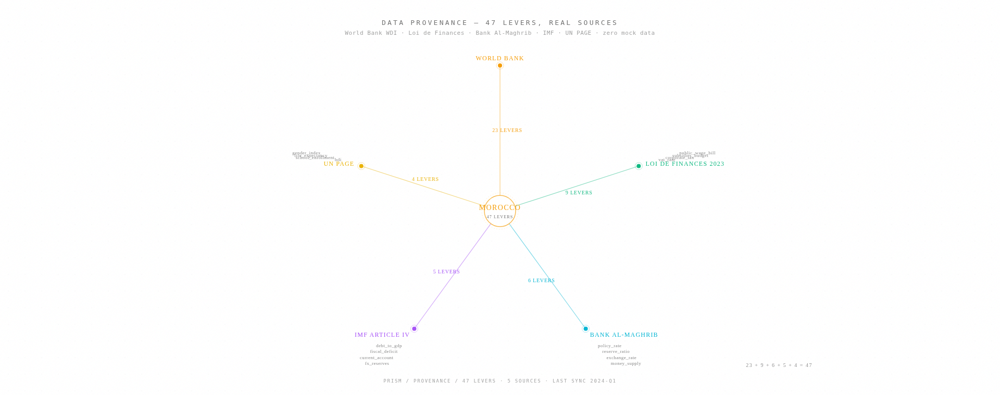
</picture>

## Research methodology

The full mathematical formalism, computational architecture, validation framework, and limitations are documented in [RESEARCH.md](./RESEARCH.md). It covers the neural network equations, the seven non-linear layers, the agent swarm update rules, the causal extraction pipeline, and a comparison with DSGE and DCGE models. The original design notes, preserved word-for-word and progressively visualized, are in [NOTES.md](./NOTES.md).

## Run it

```bash
bun install
cd mini-services/simulation-engine && bun run dev   # port 3003
bun run dev                                          # port 3000
```

## Stack

Next.js 16, TypeScript, Tailwind CSS 4, Socket.io, Bun, Prisma, SQLite, d3-force, Web Audio API. The neural network is a custom MLP implementation in TypeScript — no TensorFlow, no PyTorch. 3,008 weights, SGD with momentum, He initialization, ReLU activations.

## Token economy

A policymaker reading twelve World Bank and IMF reports consumes 1.25 million tokens and forty hours. PRISM compresses the same causal content into twenty extracted edges — 2,184 tokens, traversable in milliseconds. The graph is the corpus, distilled.

<picture>
  <source media="(prefers-color-scheme: dark)" srcset="docs/token-economy-dark.png">
  <source media="(prefers-color-scheme: light)" srcset="docs/token-economy-light.png">
  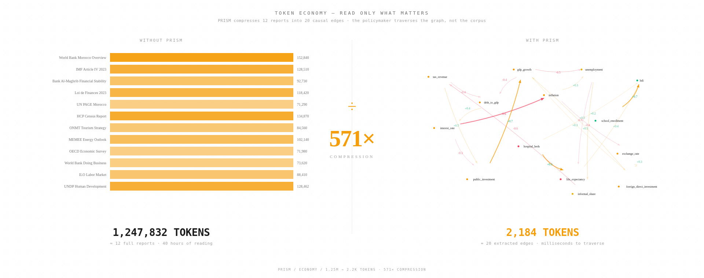
</picture>

## Paradigm delta

Switching regime is not a parameter tweak. The causal graph rewrites itself: edges are added, removed, and polarity-inverted. The delta below shows exactly what changes when liberalism becomes a planned economy — interest rates no longer suppress public investment, because the state invests regardless.

<picture>
  <source media="(prefers-color-scheme: dark)" srcset="docs/paradigm-delta-dark.png">
  <source media="(prefers-color-scheme: light)" srcset="docs/paradigm-delta-light.png">
  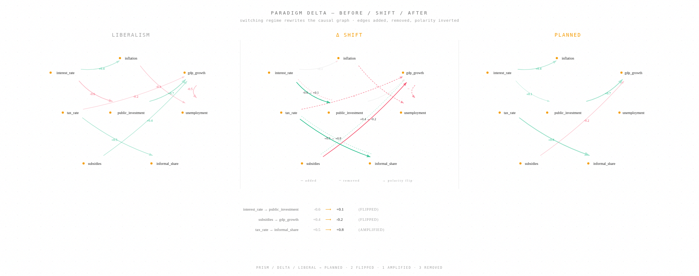
</picture>

## The kernel

The simulation is formalized as an operating system. A Kernel runs 12 phases every 200ms tick — BOOT, EXTRACT, NEURAL, NONLINEAR, SWARM, LIFECYCLE, GOVERN, BLACKSWAN, PARADIGM, COMMIT, EMIT, HALT. Subsystems register for phases. A syscall surface exposes `read_state`, `set_lever`, `get_phase`, `get_uptime`, `register_subsystem`, `disable_phase`. The engine that did the work now has a structure that can be reasoned about, extended, and observed. The full specification is in [docs/KERNEL.md](./docs/KERNEL.md).

<picture>
  <source media="(prefers-color-scheme: dark)" srcset="docs/kernel-architecture-dark.png">
  <source media="(prefers-color-scheme: light)" srcset="docs/kernel-architecture-light.png">
  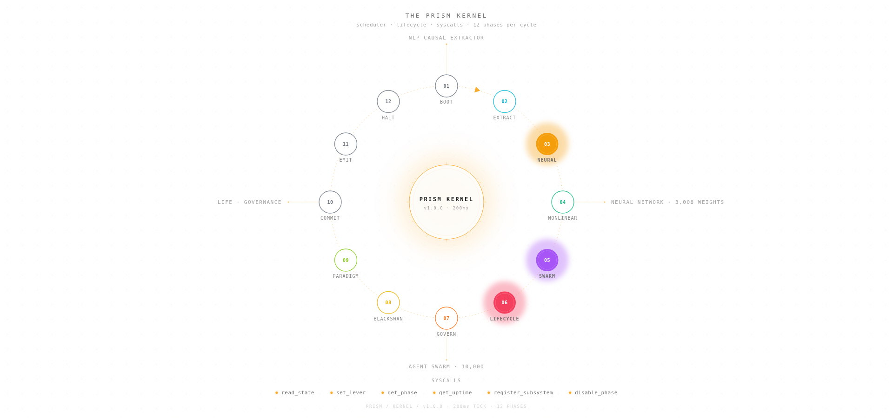
</picture>

## The life system

The 10,000 agents are not static. Each has an age, a life stage (infant, child, student, worker, mature, retiree, elder, deceased), a household, children, health, and fertility. Agents are born, go to school, work, form households, reproduce, retire, and die. Each death triggers a replacement birth — the population is stable but the individuals turn over. Median age 28, matching Morocco. One tick is one month; twelve ticks is a year; a generation passes in 360 ticks.

<picture>
  <source media="(prefers-color-scheme: dark)" srcset="docs/life-cycle-dark.png">
  <source media="(prefers-color-scheme: light)" srcset="docs/life-cycle-light.png">
  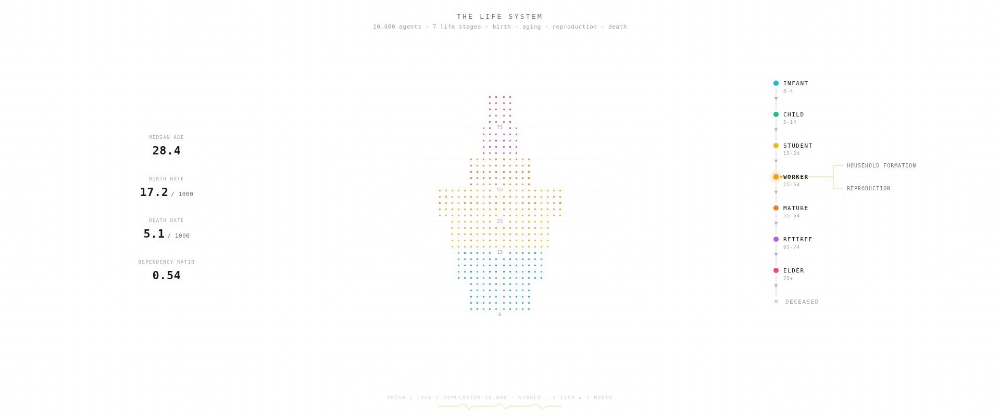
</picture>

## The governance system

The country has a state that manages. Eight ministries receive budget allocations totaling 500 Mrd MAD, matching Morocco's Loi de Finances. Each spends according to its bureaucratic efficiency; the remainder is leakage to corruption. Service quality drifts with spending. Capacity drifts with governance effectiveness. Switching paradigm reallocates the budget — liberalism favors infrastructure and defense, planned favors social and education.

<picture>
  <source media="(prefers-color-scheme: dark)" srcset="docs/governance-matrix-dark.png">
  <source media="(prefers-color-scheme: light)" srcset="docs/governance-matrix-light.png">
  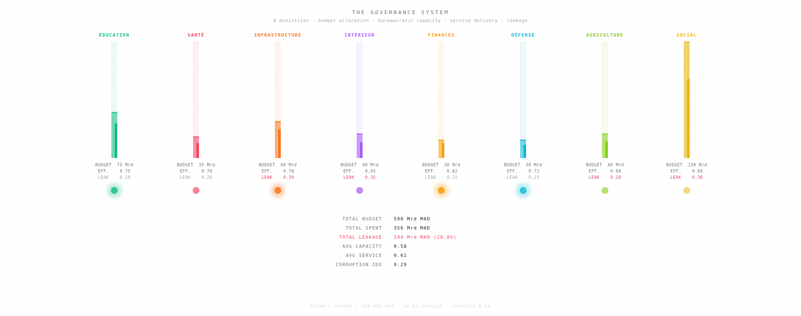
</picture>

## Emergence

When the Kernel runs the Life system through the Governance layer, patterns arise that are not coded. Business cycles oscillate as ministry spending, agent income, and GDP output interact. Political waves emerge as demographic cohorts age — a youth bulge reaching working age shifts faction stress and threat probabilities. Cultural shifts accumulate over a generation as education levels change behavior. The causality is long, indirect, and emergent.

<picture>
  <source media="(prefers-color-scheme: dark)" srcset="docs/emergence-dark.png">
  <source media="(prefers-color-scheme: light)" srcset="docs/emergence-light.png">
  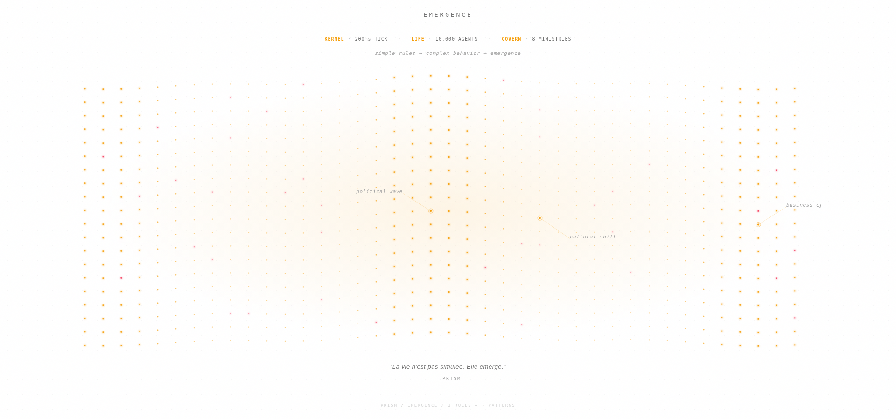
</picture>

## Visual system

The complete set of sixteen diagrams — dark and light, adaptive to your theme — is collected in a standalone gallery: [docs/gallery.html](./docs/gallery.html). Open it in any browser to scroll through the entire system in one page.

For the navigable codebase graph — every engine file, every import dependency, clickable and traceable — open the [interactive architecture map](./docs/architecture-interactive.html).

A pinned ubiquitous language defining every PRISM term (lever, indicator, scar, fragility, paradigm, polarity inversion) is in [docs/GLOSSARY.md](./docs/GLOSSARY.md). The engine's observable signals, tick budget, and event contracts are in [docs/TELEMETRY.md](./docs/TELEMETRY.md). The Kernel specification — lifecycle, subsystems, syscalls — is in [docs/KERNEL.md](./docs/KERNEL.md).

The manifesto below renders the project's founding words — "des liens de liens de liens de liens de liens" — as the recursive causal chain it always was.

<picture>
  <source media="(prefers-color-scheme: dark)" srcset="docs/manifesto-dark.png">
  <source media="(prefers-color-scheme: light)" srcset="docs/manifesto-light.png">
  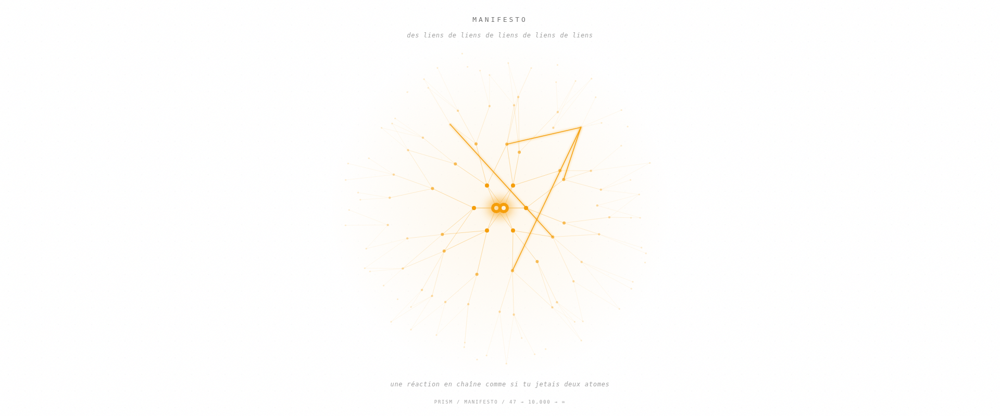
</picture>

## License

MIT
