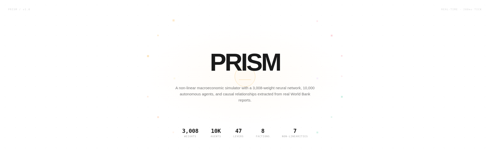
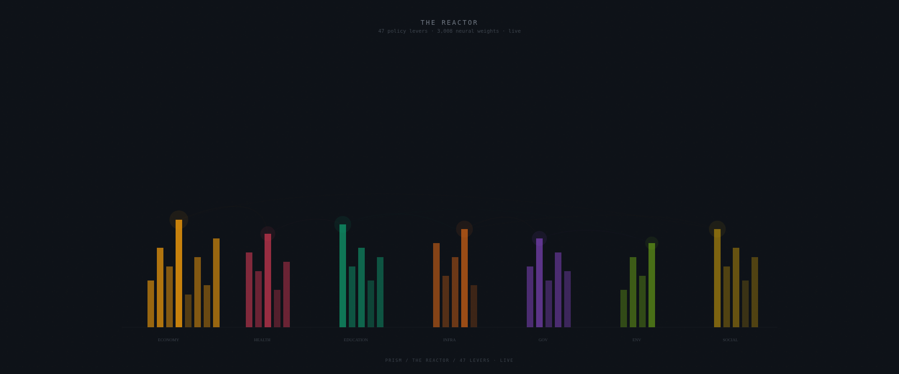

# PRISM

A non-linear macroeconomic simulator. 47 real policy levers feed a 3,008-weight neural network that computes 15 economic indicators. 10,000 autonomous agents across 8 political factions react in real time. Causal relationships are extracted from live World Bank and IMF reports by an LLM — not hardcoded.

<picture>
  <source media="(prefers-color-scheme: dark)" srcset="docs/banner-dark.png">
  <source media="(prefers-color-scheme: light)" srcset="docs/banner-light.png">
  
</picture>

## The reactor

47 policy levers, grouped into 8 categories, rising like prisms from a baseline. Each prism's height encodes its current value. When you adjust one, the neural network recomputes all 15 indicators, agents react, and the prisms shift in real time.

<picture>
  <source media="(prefers-color-scheme: dark)" srcset="docs/reactor-dark.png">
  
</picture>

## Architecture

<picture>
  <source media="(prefers-color-scheme: dark)" srcset="docs/architecture-dark.png">
  <source media="(prefers-color-scheme: light)" srcset="docs/architecture-light.png">
  
</picture>

The engine processes data through six layers. Each layer transforms its input without hardcoded rules — the system learns causal relationships from real documents and computes indicators via a trained neural network.

## How it works

You pick a policy lever — say, the VAT rate. You drag it from 20% to 25%. The neural network forward-passes the new lever vector and produces updated values for GDP, unemployment, inflation, debt-to-GDP, life expectancy, HDI, Gini, and seven other indicators. These aren't formulas — they're learned weights that approximate the economic relationships discovered in real data.

Meanwhile, 10,000 agents across 8 factions (labor unions, employers, military, clergy, youth, rural, urban elite, informal economy) update their trust, stress, and behavior. If stress crosses a threshold, agents start striking, rioting, or rebelling. The system detects political threats: coup risk, civil war probability, revolution likelihood.

Seven layers of non-linearity sit between the neural network output and the final indicators:

- Debt above 80% of GDP triggers exponential risk (not linear)
- Inflation above 8% enters a self-reinforcing spiral
- Unemployment above 15% causes a bifurcation — the system jumps to a different regime
- Hysteresis: once a crisis happens, the system remembers it. Recovery doesn't erase the scar
- Feedback loops amplify instability up to a saturation point
- Cascade effects: high revolution risk triggers secondary collapses
- Thermodynamic equilibrium: over-optimizing one sector penalizes the whole system

## NLP causal extraction

The system reads real economic reports and extracts causal relationships automatically.

```
POST /api/causal/extract
{ "url": "https://www.worldbank.org/en/country/morocco/overview" }
```

The LLM analyzes the document, identifies variable pairs, and quantifies each relationship with a coefficient (-1 to +1), a delay in months, a confidence score, and a rationale. The extracted edge is persisted to SQLite. The more documents you feed it, the richer the causal graph becomes.

Example extraction from a World Bank report:

```
public_investment → gdp_growth
  coefficient: +0.7
  delay: 12 months
  confidence: 80%
  rationale: "Public investment stimulates medium-term growth"
```

## Black swan events

Ten crisis types strike stochastically: pandemic, earthquake, market crash, coup, drought, cyberattack, refugee crisis, oil shock, harvest failure, diplomatic crisis. Each one can trigger cascading chains — a pandemic may cause a market crash, which may trigger a coup. When the system is fragile, up to three crises hit simultaneously.

## Paradigm engine

Switching political regime doesn't just change parameters. It rewrites the causal weight matrix and flips edge polarities. Under a planned economy, raising interest rates no longer suppresses public investment — the state invests regardless. Five regimes are available: Liberalism, Planned, Technocracy, Authoritarian, Transition.

## Decree system

Type a decree in French. The system parses it, identifies the affected levers, calculates the fiscal cost, and applies the changes.

```
"Construire 10 hôpitaux"          → hospital_beds +0.13, cost 1.5 Mrd MAD
"Plan de relance économique"      → 3 levers modified, cost 92 Mrd MAD
"Transition énergétique verte"    → 3 levers modified, cost 12 Mrd MAD
"Réforme fiscale globale"         → 4 levers modified, saves 20 Mrd MAD
```

Before applying, a projection engine simulates 2 years forward and returns a verdict: favorable, mitigé, défavorable, or catastrophique.

## Data

All 47 baseline values are real. Sources:

- World Bank Open Data (WDI indicators with exact codes like `NY.GDP.MKTP.CD`)
- Loi de Finances Maroc 2023
- Bank Al-Maghrib
- IMF Article IV Consultation
- UN PAGE Morocco

## Run it

```bash
bun install
cd mini-services/simulation-engine && bun run dev   # port 3003
bun run dev                                          # port 3000
```

## Stack

Next.js 16, TypeScript, Tailwind CSS 4, Socket.io, Bun, Prisma, SQLite, d3-force, Web Audio API. The neural network is a custom MLP implementation in TypeScript — no TensorFlow, no PyTorch. 3,008 weights, SGD with momentum, He initialization, ReLU activations.

## License

MIT
